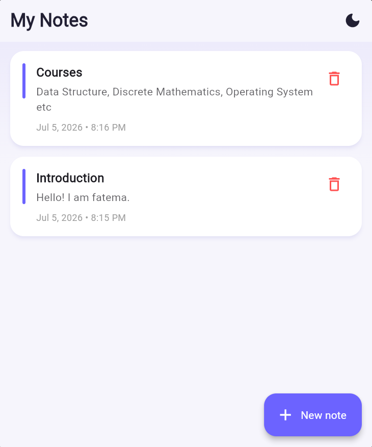
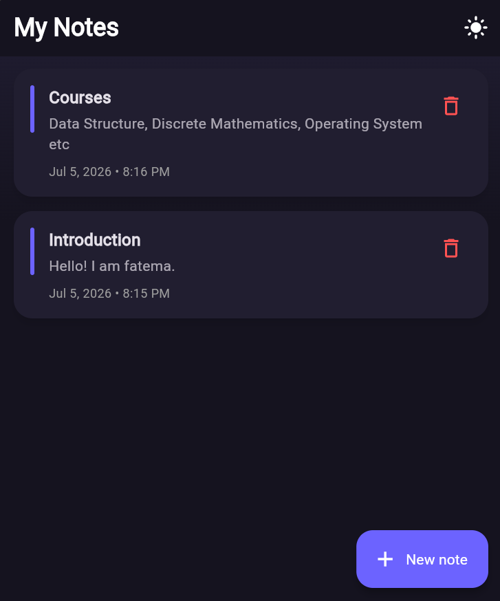
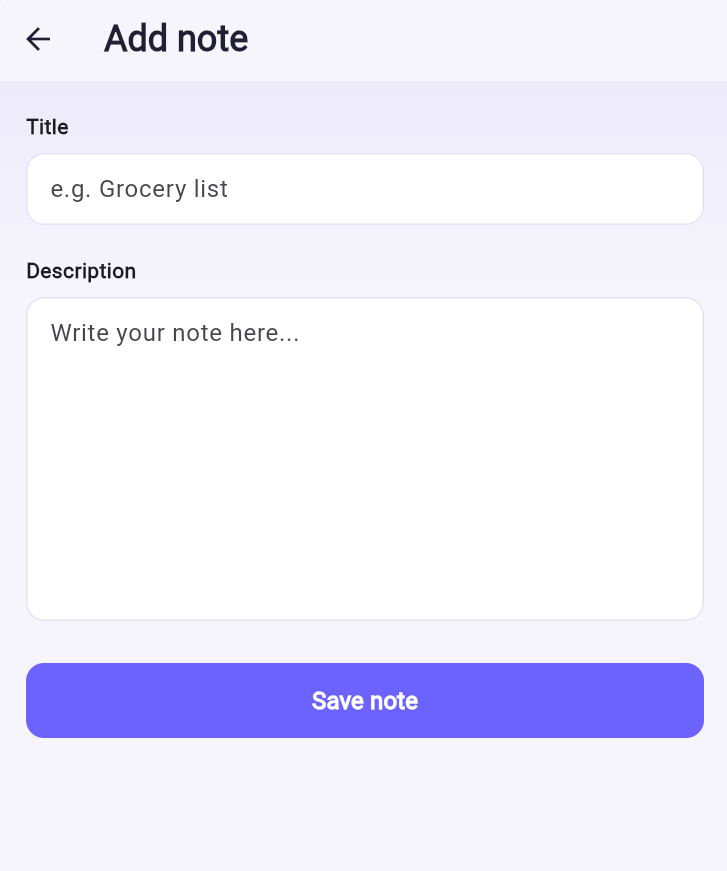

# 📝 Notes Management App

A simple, elegant Notes Management application built with **Flutter** and **Cloud Firestore**, allowing users to create, view, update, and delete notes in real time.

---

## 📱 About the Project

**Notes Management App** lets users capture and organize their thoughts with a clean, minimal interface. Every note is stored in the cloud using **Cloud Firestore**, so changes sync instantly across the app the moment they happen — no manual refresh needed.

This project focuses on:

- Full CRUD (Create, Read, Update, Delete) operations with **Cloud Firestore**
- Real-time data sync using Firestore's `snapshots()` stream
- Clean, modular Flutter architecture (Models / Services / Screens)
- A polished, custom UI with light and dark theme support

---

## 📸 Screenshots

| Notes List (Light Mode) | Notes List (Dark Mode) |
|---|---|
|  |  |

| Add Note Screen |
|---|
|  |

---

## ✨ Features

### 🏠 Notes List Screen
- Displays all notes stored in Firestore, updated in **real time**
- Each note card shows its title, description, and the date/time it was created
- A friendly empty state when no notes exist yet
- Tap a note to edit it, or tap the delete icon to remove it (with a confirmation dialog)
- Light/Dark theme toggle in the app bar

### ➕ Add / Edit Note Screen
- A single screen handles both creating a new note and editing an existing one
- Form validation ensures both title and description are filled in before saving
- Clean input fields with helpful placeholder text

### ☁️ Cloud Firestore Integration
- **Create**: Adds a new note document to the `notes` collection
- **Read**: Streams all notes in real time, sorted by most recent first
- **Update**: Edits an existing note's title and description
- **Delete**: Removes a note permanently from the database

### 🎨 Theming
- Custom light and dark themes with a consistent accent color
- Subtle gradient backgrounds and soft card shadows for a modern look
- Theme preference can be toggled anytime from the home screen

---

## 🛠️ Tech Stack

| Category | Technology |
|---|---|
| Framework | Flutter (Dart) |
| Backend / Database | [Cloud Firestore](https://firebase.google.com/docs/firestore) |
| Firebase Core | [`firebase_core`](https://pub.dev/packages/firebase_core) |
| Firestore SDK | [`cloud_firestore`](https://pub.dev/packages/cloud_firestore) |
| Date Formatting | [`intl`](https://pub.dev/packages/intl) |

---

## 📂 Project Structure

```
lib/
├── main.dart                     # App entry point, theme setup, Firebase initialization
├── firebase_options.dart         # Auto-generated Firebase configuration
├── theme_notifier.dart           # Global light/dark theme toggle logic
├── models/
│   └── note_model.dart           # Note data model (title, description, timestamp)
├── services/
│   └── firestore_service.dart    # All Create, Read, Update, Delete operations
└── screens/
    ├── notes_list_screen.dart    # Displays all notes in real time
    └── add_edit_note_screen.dart # Form for creating or editing a note

screenshots/
├── notes_list_light.png
├── notes_list_dark.png
└── add_note_screen.png
```

---

## 🚀 Getting Started

### Prerequisites
- [Flutter SDK](https://docs.flutter.dev/get-started/install) (3.0.0 or higher)
- Android Studio / VS Code with the Flutter & Dart plugins
- A Firebase project with Cloud Firestore enabled
- A connected device, emulator, or a web browser (e.g., Microsoft Edge/Chrome)

### Installation

1. **Clone the repository**
   ```bash
   git clone https://github.com/<your-username>/note_management_app.git
   cd note_management_app
   ```

2. **Install dependencies**
   ```bash
   flutter pub get
   ```

3. **Connect your own Firebase project**

   This project uses [FlutterFire CLI](https://firebase.google.com/docs/flutter/setup) to connect to Firebase. If you'd like to run this app with your own Firestore backend:
   ```bash
   dart pub global activate flutterfire_cli
   flutterfire configure
   ```
   This will regenerate `lib/firebase_options.dart` with your own project's configuration.

4. **Run the app**
   ```bash
   flutter run
   ```
   To run in a specific browser (e.g., Edge):
   ```bash
   flutter run -d edge
   ```

---

## 🎯 How It Works

1. Open the app to see all existing notes on the **Notes List Screen**.
2. Tap **New note** to create a note with a title and description.
3. Tap any note card to edit its contents.
4. Tap the delete icon on a note to remove it, after confirming.
5. All changes are saved directly to Cloud Firestore and reflected instantly across the app.
6. Toggle between light and dark mode anytime using the icon in the app bar.

---

## 📌 Notes

- All data is stored in Cloud Firestore under the `notes` collection.
- No authentication is required — this app is designed as a simple, single-user CRUD demonstration.
- Firestore security rules are currently set to test mode for development purposes.

---

## 👤 Author

**Fatema Tuz Zohora **
| Department of Computer Science and Engineering

---

## 📄 License

This project is developed for educational purposes as part of a course assignment.
